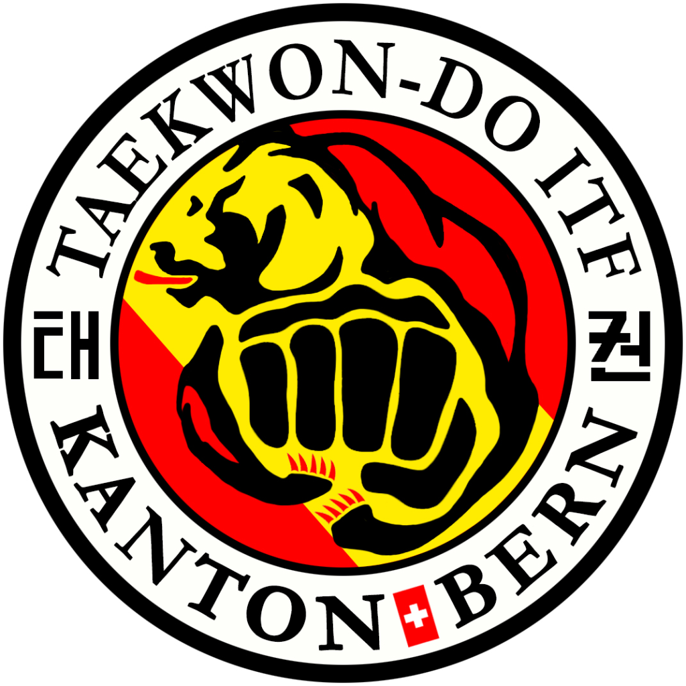
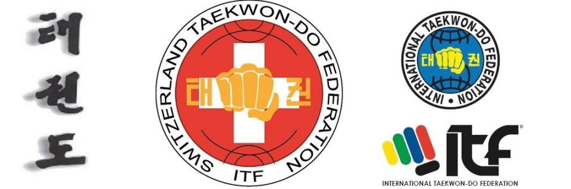

Bienvenu sur le site web du club _Bergel Taekwon-Do ITF_.

Originaire de la Corée, le Taekwon-Do est un art martial fondé en 1955 par le Général Choi Hong Hi.

Inégalé en terme de puissance et de technique, le Taekwon-Do est également reconnu comme étant formateur de l’esprit. Ces préceptes favorisent à développer le sens de la justice, une force de caractère, d’humilité et de détermination. C’est pourquoi le Taekwon-Do est qualifié « d’Art d’autodéfense ».

Bergel Taekwon-Do fait parti de l'association [Association Taekwon-Do ITF Canton de Berne/Verein Taekwon-Do ITF Kanton Bern](https://taekwondoitf-bern.github.io/) et de la [Fédération Suisse de Taekwon-Do ITF](https://www.taekwondo-itf.ch).

{:width="50%"}
{:width="100%"}

_Mise à jour de ce site: 01-05-2024_
