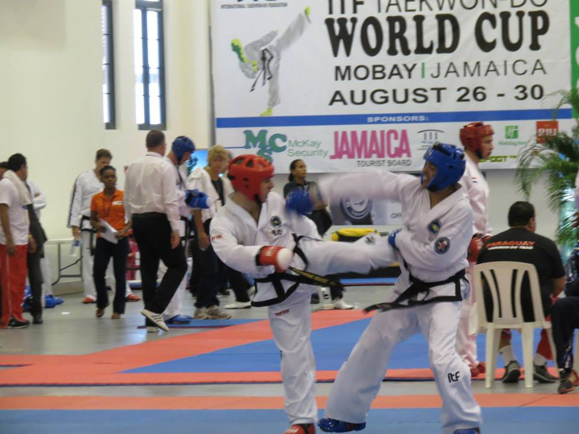
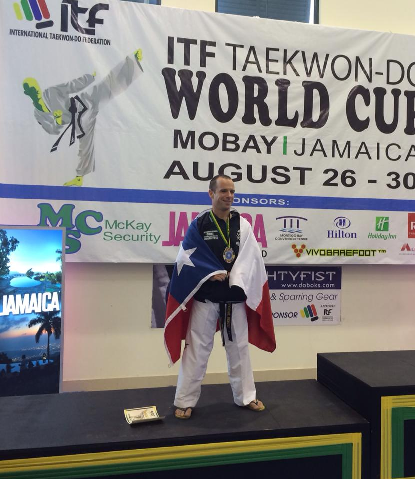

Busabunim Alexandre Bergel pratique le Taekwon-Do depuis plus de 30 ans. Il est actuallement 3ème Dan de Taekwon-Do ITF (numéro CHL-3-48).

Pendant plus de 10 ans, il a été dans l'équipe de selection Chilienne. En particulier, il a participé dans:
- plus de 30 competitions, nationales et internationales depuis 2011
- 5 évènements mondiaux (Championnat du Monde et Coupe du Monde)

Il a gagné deux médailles de coupe du monde:
- 🥉 Bronze en technique, à Budapest en 2016
- 🥈 Argent en technique en Jamaïque en 2014

Il a également gagné 5 médailles dans des championats Sud-Américains et Pan-Américains.

Le complet CV sportif de Alexandre Bergel est [disponible online](https://bergel.eu/sport.pdf).

Alexandre Bergel parle Français 🇫🇷, Espagnol 🇪🇸, Anglais 🇬🇧, Allemand 🇨🇭.

En dehors des tatamis, Alexandre Bergel a un doctorat en Science Informatique de l'Université de Berne. Il est [chercheur en informatique](https://bergel.eu/).

{:width="80%"}
{:width="80%"}
